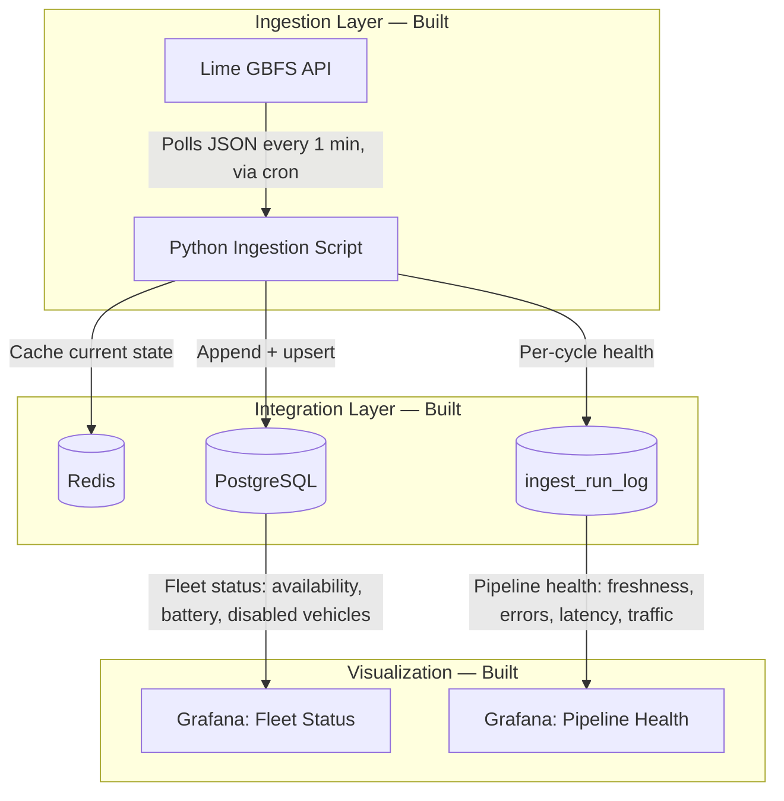

# gbfs-fleet-telemetry

> ✅ **Complete:** Ingestion, integration, scheduling, pipeline
> observability, and Grafana visualization are all live and running
> against real data. See Status below, and Out of Scope for what's
> deliberately not included.

A telemetry pipeline for edge hardware fleets, using the live GBFS
(General Bikeshare Feed Specification) feed from Lime (San Francisco)
as a stand-in for the scale and noise of a real fleet. Demonstrates
ingestion reliability, a dual-sink integration layer (cache +
source of truth), pipeline observability, and dashboarding — the
core discipline of a production telemetry system, end to end.

## Status

| Layer | Status | Notes |
|---|---|---|
| Infrastructure (Docker Compose: Postgres, Redis, Grafana) | ✅ Built | Healthchecks, log rotation, `.env`-based secrets |
| Ingestion (`src/poller/ingest.py`) | ✅ Built | Polls Lime's San Francisco GBFS feed every 1 min via cron |
| Integration (writes to Redis + Postgres) | ✅ Built | Redis: best-effort cache. Postgres: transactional, source of truth |
| Scheduling & resilience | ✅ Built | Cron-driven, not an in-process loop — see [Implementation Plan](./docs/implementation-plan.md) for the reasoning |
| Pipeline observability (`ingest_run_log`) | ✅ Built | Per-cycle success/failure, duration, error tracking |
| Visualization (Grafana dashboards) | ✅ Built | Fleet Status (availability gauge, battery bar chart, critical-battery stat, top disabled vehicles) + Pipeline Health (four golden signals: freshness, errors, latency, traffic). Datasource and dashboards are provisioned from files under `infrastructure/grafana/` — they survive a full `docker compose down -v`, not just the database. |

See **Out of Scope** below for what this project deliberately does
not include.

## System Architecture



## Out of Scope (By Design)

This project intentionally stops at a working, observable
ingestion → storage → visualization pipeline rather than building
every layer of a full Lambda architecture thin. Not built:

* **Streaming alert service** — the Redis cache already holds each
  cycle's current state, so a subscriber evaluating it for anomalies
  (e.g. disabled + battery drop) is a natural extension, but
  real-time triage wasn't the priority for this iteration.
* **Batch MTBF / reliability analytics** — `fact_vehicle_status` is
  structured as an append-only ledger specifically so this kind of
  analysis is possible later without a schema change; the batch
  script itself doesn't exist yet.

See [Implementation Plan](./docs/implementation-plan.md) for the
full reasoning behind this scope.

## Documentation
* 🛠️ [Implementation Plan & Status](./docs/implementation-plan.md) — full build history, design decisions (including where the implementation deviates from the original plan and why), and remaining work.

## Quickstart

```bash
# 1. Clone and configure
git clone https://github.com/Rick-Houser/gbfs-fleet-telemetry.git
cd gbfs-fleet-telemetry
cp .env.example .env   # fill in POSTGRES_USER / POSTGRES_PASSWORD / POSTGRES_DB / Grafana admin creds

# 2. Bring up the stack
docker compose up -d
docker compose ps       # confirm postgres, redis, grafana all show healthy

# 3. Set up the Python environment
python -m venv .venv
source .venv/bin/activate
pip install -r requirements.txt

# 4. Run one ingestion cycle manually
python src/poller/ingest.py

# 5. Verify data landed
docker exec -it telemetry-postgres psql -U $POSTGRES_USER -d $POSTGRES_DB \
  -c "SELECT * FROM ingest_run_log ORDER BY run_at DESC LIMIT 1;"

# 6. (Optional) Schedule it via cron for continuous polling
crontab -e
# * * * * * cd /path/to/gbfs-fleet-telemetry && .venv/bin/python src/poller/ingest.py >> logs/ingest.log 2>&1

# 7. Open Grafana
open http://localhost:3000
# The PostgreSQL datasource and both dashboards (Fleet Status,
# Pipeline Health) load automatically from infrastructure/grafana/ —
# no manual setup needed, even on a fresh clone.
```