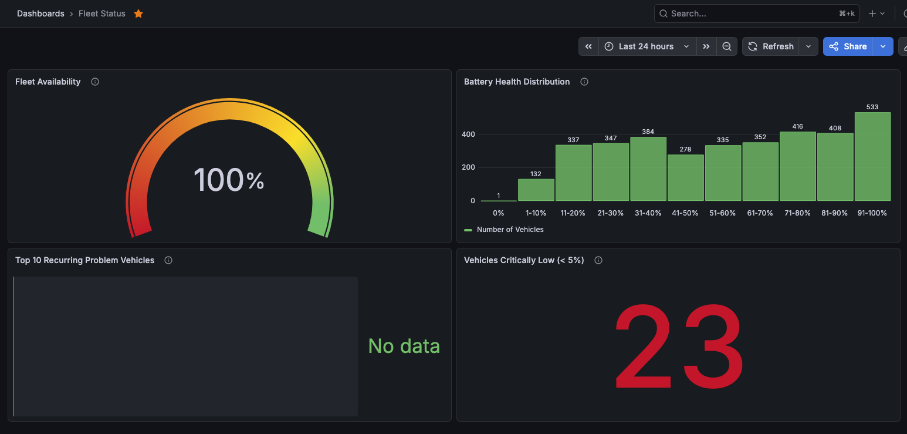
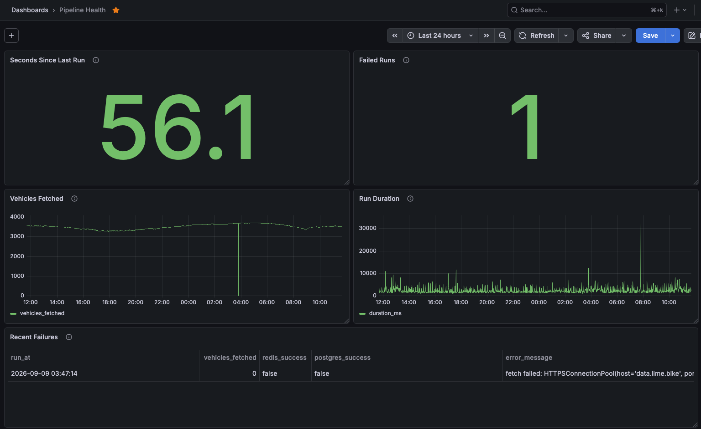
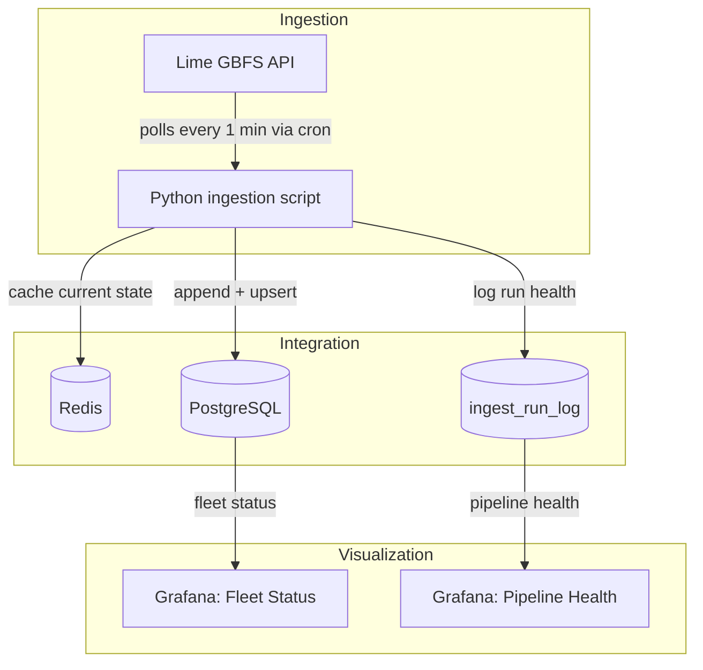

# gbfs-fleet-telemetry

Telemetry pipeline for a bike/scooter fleet, built on Lime's public GBFS feed for San Francisco. Uses live vehicle data as a stand-in for a real edge hardware fleet: ingestion, storage, pipeline observability, and Grafana dashboards, all running locally in Docker.

## Status

| Layer | Status | Notes |
|---|---|---|
| Infrastructure (Postgres, Redis, Grafana via Docker Compose) | Done | Healthchecks, log rotation, secrets in `.env` |
| Ingestion (`src/poller/ingest.py`) | Done | Polls Lime's SF feed every minute via cron |
| Integration (Redis + Postgres) | Done | Redis is a best effort cache. Postgres is the source of truth |
| Scheduling | Done | Cron, not a long running process. See the [implementation plan](./docs/implementation-plan.md) for why |
| Pipeline observability (`ingest_run_log`) | Done | Logs success/failure, duration, and errors per run |
| Grafana dashboards | Done | Fleet status + pipeline health, provisioned from files so they survive a full reset |

What's not built is listed at the bottom.

## Dashboards

### Fleet Status


Availability gauge, battery distribution, and a list of vehicles that get disabled most often. Battery level is tracked separately from the disabled flag on purpose. A vehicle can hit 0% charge without ever being marked disabled by Lime's system, and I wanted a panel that would catch that.

### Pipeline Health


Built around the four golden signals: freshness, errors, latency, traffic. This one watches the pipeline itself, not the fleet.

Both dashboards load automatically from `infrastructure/grafana/` on startup, no manual setup. Run the quickstart below and you get these for free.

## Architecture



## What's not here

A couple things from the original design that I decided not to build for this pass:

* **Streaming alerts.** Redis already holds current state per vehicle, so a subscriber watching for anomalies (disabled + sudden battery drop, say) would be a natural next piece. Didn't build it here.
* **MTBF / reliability analytics.** `fact_vehicle_status` is append only on purpose so this kind of batch analysis is possible later without touching the schema. The actual script doesn't exist yet though.

More on the reasoning in the [implementation plan](./docs/implementation-plan.md), including why the data source changed partway through and a couple of real bugs I ran into building the Grafana side of things.

## Quickstart

```bash
# clone and configure
git clone https://github.com/Rick-Houser/gbfs-fleet-telemetry.git
cd gbfs-fleet-telemetry
cp .env.example .env   # fill in POSTGRES_USER / POSTGRES_PASSWORD / POSTGRES_DB / grafana admin creds

# bring up the stack
docker compose up -d
docker compose ps       # postgres, redis, grafana should all show healthy

# python env
python -m venv .venv
source .venv/bin/activate
pip install -r requirements.txt

# run one ingestion cycle
python src/poller/ingest.py

# check it landed
docker exec -it telemetry-postgres psql -U $POSTGRES_USER -d $POSTGRES_DB \
  -c "SELECT * FROM ingest_run_log ORDER BY run_at DESC LIMIT 1;"

# optional: schedule it
crontab -e
# * * * * * cd /path/to/gbfs-fleet-telemetry && .venv/bin/python src/poller/ingest.py >> logs/ingest.log 2>&1

# open grafana
open http://localhost:3000
# datasource and both dashboards load automatically, nothing to configure
```