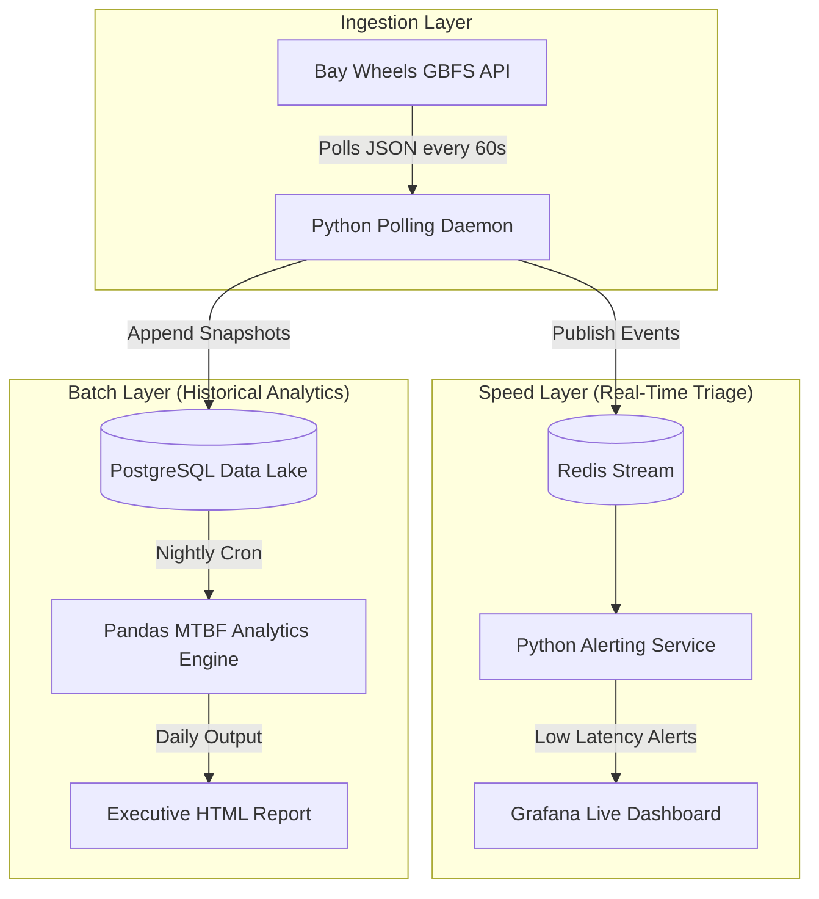

# gbfs-fleet-telemetry

> 🚧 **Work in Progress:** Currently building the base infrastructure and polling daemon.

A Lambda architecture telemetry pipeline for edge hardware fleets that handles live incident triage and batch MTBF analytics using GBFS data streams.

This project simulates the scale and noise of an autonomous robotics fleet by utilizing the live GBFS (General Bikeshare Feed Specification) feed from Bay Wheels. It demonstrates the ability to triage critical hardware failures in real-time while simultaneously calculating macro-level reliability metrics (MTBF, Uptime) across different hardware generations.

## System Architecture

## Documentation
* 🛠️ [Implementation Roadmap(coming soon)](./)

## Quickstart
*(Deployment commands coming soon)*